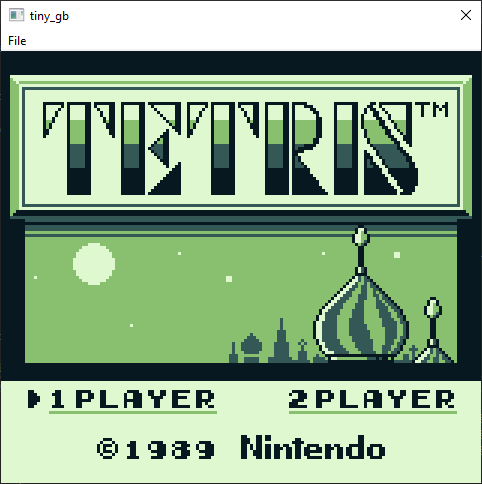
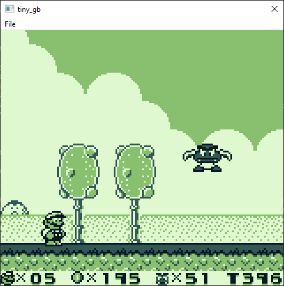
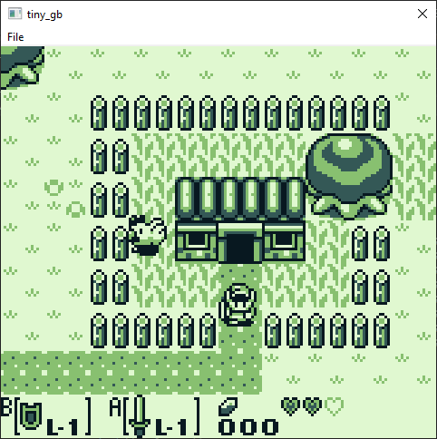

# TinyGB - GameBoy Emulator

This GameBoy emulator was developed in three weeks during my christmas break and is mostly
for educational purposes. It is written in C99 and the goal of the project was to have an easy entry point into emulator development and get a better understanding of the underlying hardware.

There are still a few features missing most prominently audio and certain cartridge types.
The emulation is far from accurate and there are definitely better emulators out there,
but the code is quite compact and maybe a nice starting point for other people.

Currently only Windows and MSVC is supported.

## How to Build locally?

Start a Visual Studio x64 Command Prompt and navigate to the project's root directory.
Execute the build.bat file and you should be ready to go.

## Screenshots

## Credits

- Game Boy Hardware Wiki: https://gbdev.io/pandocs/
- Opcode Table: https://izik1.github.io/gbops/